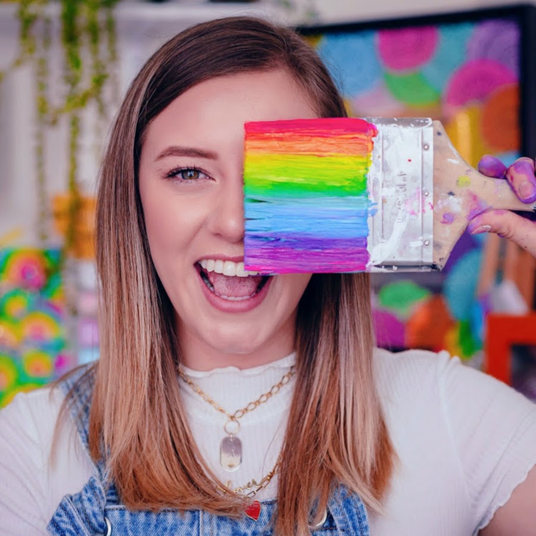

# Dani Hoyos

Dani Hoyos es una de las principales creadoras y exponentes de arte digital en Hispanoamérica. Desde hace 5 años se ha dedicado a crear contenido en plataformas digitales a través de diferentes canales de Youtube: “Dani Hoyos”, y el más reciente “Priti by Dani”, contenido que comenzó por su amor a las mandalas y ahora su arte se ha expandido con challenges, diversas series, pruebas de materiales, pintura en paredes, vlogs y cursos, sin olvidar lo que la ha motivado desde el principio: la pasión por compartir arte y seguir sus sueños. 

